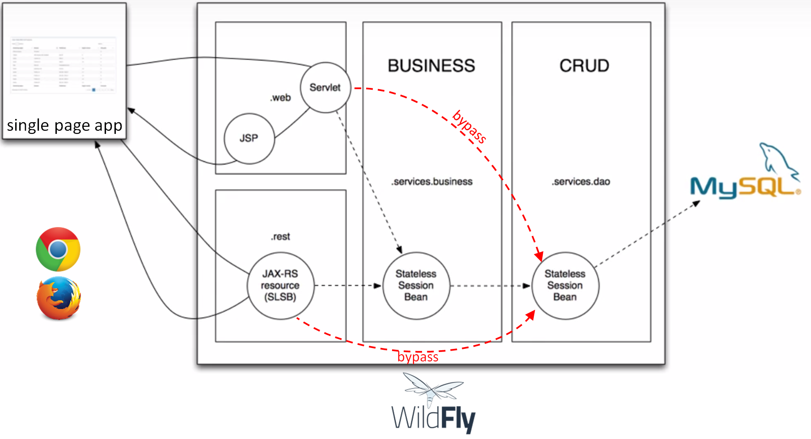

# HEIGVD-AMT-Bootcamp
 
## Students:
Fabien Franchini  
Sébastien Henneberger    
 
## Objecive of the project
Autodeploy a simple Java EE app on an application server :

- Implement Model–view–controller (MVC) design pattern.
- Understand and use managed components like EJBs or servlets, for exemple.
- Configure protected pages with http sessions and filters.
- Use and configure a datasource on the application server.
- Use and configure a MySQL jdbc driver to save user account in a MySQL database.
- Implement an API REST to do CRUD operation on user account.
 
## Goal of the project
All guests can :

1. visit the landing page
2. sign up to the web application

All users who have an account on the application can do these additional things :

1. log in
2. access the home page
3. access the single page app called "userManager.html" to get a list of all users who have an account on this application
4. log out
 
## Informations about Docker images
**Wildfly application server**: We use the jboss/wildfly Docker image available in Docker Hub <https://hub.docker.com/r/jboss/wildfly>

**MySQL database**: We use the standard MySQL image available in Docker Hub <https://hub.docker.com/r/_/mysql/>

**PhpMyAdmin**: We use the official phpMyAdmin image avilable in Docker Hub <https://hub.docker.com/r/phpmyadmin/phpmyadmin/>

## Instruction about running the application via Docker
Go in the `topology` directory and execute `docker-compose up` command.
 
## Instruction about accessing the application via your browser
**URL of the app: http://{IP}:9090/amtBootcampApp-1.0**
 
If you use **Docker for Windows** (<https://docs.docker.com/docker-for-windows/>) or **Docker for Mac** (<https://docs.docker.com/docker-for-mac/>) :

replace **{IP}** per "localhost" :
 
<http://localhost:9090/amtBootcampApp-1.0>

or per "127.0.0.1" :

<http://127.0.0.1:9090/amtBootcampApp-1.0>
 
If you use **Docker toolbox**, replace {IP} per the ip of the machine that Docker is configured to use. By default, Docker is configured to use default machine with ip 192.168.99.100.
 
If you are not sure about which machine is running, you can know this information with `docker-machine active`.
For exemple, if the previous command returned "machine1", then enter `docker-machine ip machine1`, to know with which ip.
 
You can also enter `docker-machine ls`, to list all machines.
 
Default machine : <http://192.168.99.100:9090/amtBootcampApp-1.0>

## Login and password for application
Application: login, password    

MySQL: root, adminpw     

Wildfly: admin, admin    

Web app: There is already one user saved in database: Shenn, shenn

## API REST to do CRUD operations on user account
All API access is over HTTP and not HTTPS, and accessed from the <http://{IP}:9090/amtBootcampApp/api/>. All data is sent and received as JSON.

All requests don't require authentication.

#### HTTP verbs
| Verb   | Target     | Description       |
|--------|------------|-------------------|
| GET    | /users     | Get all users (id, username) who are saved in database.             |
|        | /users/{id}| Get the desired user (id, username)                                 |
| POST   | /users     | Create a new user with the username specified (password = password).|
| PATCH  | /users/{id}| Update the username of the desired user.                            |
| DELETE | /users/{id}| Delete completely the desired user.                                 |

To keep confidentiality, GET methods don't return the user password.

POST method don't accept password attribute. A default password (password) is set to the new user.

PATCH requests accept only username attribute.

We can't do PUT requests for replacing all the desired resource. 

If PATCH or DELETE methods are treated without error, they returned status 200 OK, POST returns 201 CREATED and GET return FOUND.

#### Headers
| Verb   | Header                         |
|--------|--------------------------------|
| Get    | Accept: application/json       |
| POST   | Content-Type: application/json |
| PATCH  | Content-Type: application/json |
| DELETE | Accept: application/json       |

#### Errors
| Verb   | Error                                                                            |
|--------|----------------------------------------------------------------------------------|
| Get    | 404 NOT FOUND, if id provided don't exist.                                       |
| POST   | 400 BAD REQUEST, if username is empty (or contains only spaces).                 |
|        | 400 BAD REQUEST, if length of username is more long than 45 characters.          |
|        | 409 CONFLICT, if username provided already exist in database.                    |
| PATCH  | Identical as POST, but with additional 404 NOT FOUND, if id provided don't exist.|
| DELETE | 404 NOT FOUND, if id provided don't exist.                                       |

Moreover, a 500 INTERNAL SERVER ERROR is returned if database isn't reachable.

#### Scripts Postman for testing the API
You can import postman scripts in Postman for testing the API. Postman scripts are available in `./postman/amtBootcampApp.postman_collection.json`

With this collection of script, you can do CRUD operations on user account.

You can modify the IP global variable according your environment. There is a PORT global variable too.
By default, IP value is `localhost`, and PORT value is `9090`.
IP value must be the IP of the application server.

For methods GET, PATCH and DELETE, don't forget to add the id of the user that you want to treat, at the request end.

## Javadoc
Javadoc is available in `.\target\site\apidocs\index.html`

## Architecture diagram

 
## Information about implementation
 
#### Dependences injection in presentation tiers
 
In the presentation tier, especially in the servlet which is responsable to manage the sign up procedure (CheckSignupServlet.java) and in the API REST entry point of HTTP request which treat user resources (UserResource.java), there are two dependences injection :
 
1. The first is to have a reference on the service tier that implements business logic. It is used to check if a username is available or to check if credentials provided are correct, for example.
  
2. The second is to have a reference on the service tier which implements DAO. It is used when all conditions are met to directly speak with the database via DAO, without passing by the service tier which implements logic business. It's clearly a bypass, and that add two ways to the diagram, but like this we don't uselessly pass inside the logic business and we don't need to create additional methods in the business logic which do just a call to DAO methods.
  
#### User buffer
We could have thought that we could implement a buffer that contains all User (in the business logic or DAO service) to not always speak with database via DAO to get simple result (check if username already exists, for example), but it's not the goal of these two services.
  
#### encodage
UTF-8 encodage is used for the application server and for the database, so accented letters are not treated. First, we have tried to decode bytes array of string with the utf-8 Charset, and that worked with the local application server, but when we deploy .war on the application server, it didn't work.
 
#### API REST
We didn't implement PUT method, because we should completely update the resource, and password mustn't be transferred in API. So, PATCH method is better adapted.
